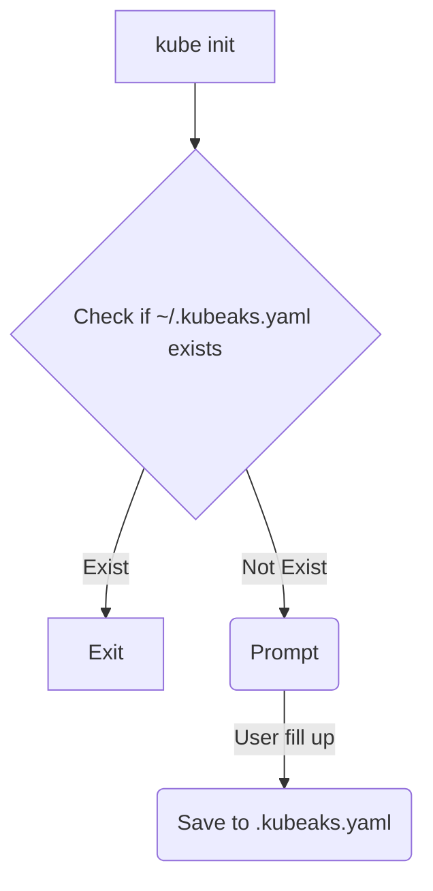

# kubeaks init

This command will output an interactive terminal for the user to put in value and the value will be save in `~/.kubeaks.yaml` for later use by kubeaks to switch AKS cluster.

mermaid
