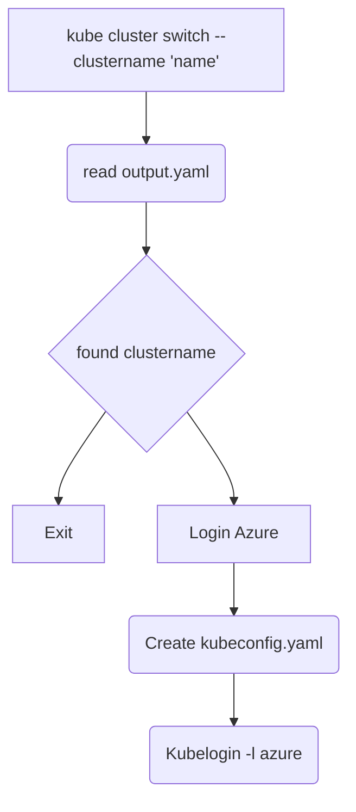

# kubeaks init

This command will check if clustername is exists in output.yaml, if exists kubeaks will login into Azure and get AKS credentials and output it into kubeconfig.yaml after that it will convert the kubeconfig.yaml using `kubelogin`.

## Todo:
* todo: kubeconfig path take from output.yaml
* todo: try using Stdin, Stdout, Stderr :D
* todo: what condition kubeaks will request credentials
* todo: if name already exists in kubeconfig, should not make a duplication